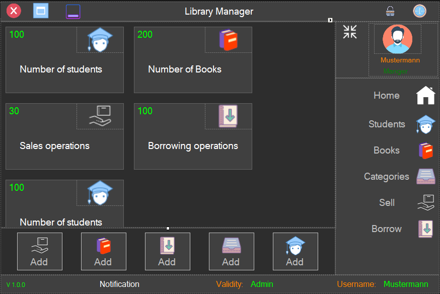

# Library Management System GUI

This project presents a graphical user interface (GUI) developed using Microsoft Visual Studio CLR (Common Language Runtime) for a library management system. The GUI encompasses various features and sections:

## Features

- **Home**: Displays general information about the library, including opening hours, news, and upcoming events.
  
- **Students**: Manages student-related tasks such as registration, updating student details, and viewing borrowing histories.
  
- **Books**: Enables users to search the library catalog, add new books, edit existing entries, and remove them. Provides details like title, author, genre, and availability.
  
- **Categories**: Organizes books into categories or genres. Allows for the creation, editing, and deletion of categories.
  
- **Sell**: Facilitates book sales management, stock updates, and transaction tracking if the library sells books.
  
- **Borrow**: Handles borrowing processes including lending books to students, tracking due dates, and managing returns.

## Usage

To run the application, open the solution file in Microsoft Visual Studio, build the project, and run the executable.

## Contribution

Contributions are welcome! If you want to contribute to the project, please fork the repository, make your changes, and submit a pull request.

## License

This project is licensed under the [MIT License](LICENSE).

